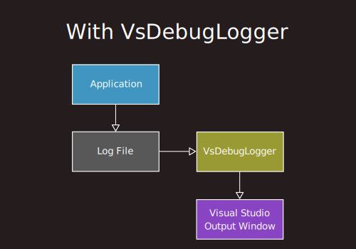

# VsDebugLogger<br><sup><sub>Speeds up Visual Studio debug output by orders of magnitude.</sup></sub>

<p align="center">
<br/>
</p>

# The problem

I am in favor of minimal logging; however, sometimes it happens that there is a lot of logging to be done. 
When this is the case, it really helps if the logging does not impose a serious performance penalty 
on the application that is doing the logging.

I tried a little experiment. I compared the time it takes to emit a log line using two different methods:
- **Debug-WriteLine** (`System.Diagnostics.Debug.WriteLine()`) 
- **File-WriteLine** (`System.IO.StreamWriter.WriteLine()` on a `System.IO.FileStream` with `Flush()` after each line)

To ensure the results were unbiased, I did the following:
- I tried with bursts of 10, 100, 1000, or 10000 log lines, 
to make sure the observations are consistent regardless of burst size, and indeed they were.
- I followed each burst with a sleep of 100 milliseconds, 
just in case something needed some time to cool down; it made no difference.
- I tried either with or without the VSColorOutput plugin; 
it made no difference either.

My observations were as follows:

- **Debug-WriteLine** takes an absolutely terrifying 1.5 millisecond per line.

- **File-WriteLine** takes a reasonable 4.4 microseconds per line.

That's an astounding 350 times faster.

I do not care what are the technical or managerial excuses behind this situation,
but to me it clearly means that some folks at Microsoft are incompetent dimwits
who should be milking goats instead of trying to develop world-class software.

# The solution

The idea behind VsDebugLogger is that we completely stop using Debug-WriteLine 
and instead we do all of our logging into a text file.
Then, we have an external process running which keeps reading text as it is being appended to the file
and emits that text to the debug output window of Visual Studio. 

This way, our application is completely desynchronized from Visual Studio 
and it is only affected by the minimal performance overhead of writing to a log file.
Visual Studio can take all the time it needs to render its output window on its own threads.

# How it works

Without VsDebugLogoger, our application typically sends its logging output both to a log file 
and to the debug output stream.
Visual Studio intercepts the debug output stream and renders it in its output window, 
but as I have already explained, this is extremely slow.

<p align="center">

</p>

With VsDebugLogger, our application sends its logging output only to a file.
VsDebugLogger keeps polling this file, and sending text to the output window of Visual Studio.

<p align="center">

</p>

The polling is done at a rate of 5 times per second, 
which is frequent enough to be perceived as instantaneous, 
and at the same time relaxed enough to have an inperceptible CPU consumption.

# How to use

First, reconfigure the way logging is done in your application 
so that it only makes use of a log file. 
In other words, your application should not be sending any log output to the debug output device anymore.
(There should be no calls to `System.Diagnostics.Debug.WriteLine()`.)

Then, add some code to the startup sequence of your application that does the following:
1. Ensures that VsDebugLogger is running.
    - This can be done simply by launching VsDebugLogger, since it takes care of the case where it is already running.
1. Establishes a named pipe connection with VsDebugLogger.
    - The named pipe is called `VsDebugLogger` and is on the local computer.
1. Tells VsDebugLogger (via the named pipe) the name of your application's log file.
    - So that VsDebugLogger knows which file to poll.
1. Tells VsDebugLogger (via the named pipe) the name of your Visual Studio Solution.
    - So that VsDebugLogger knows which running instance of Visual Studio to communicate with.
1. Keeps the named pipe connection open for as long as your application is running.
    - So that VsDebugLogger can find out when your application terminates by observing the pipe disconnection event.

Here is a function that you can add to your application, which will do the above:

```csharp
private static object setup_debug_logging( string solution_name, //
		string log_file_pathname, //
		string path_to_vs_debug_logger )
{
#if DEBUG
	System.Diagnostics.Process.Start( path_to_vs_debug_logger );
	var pipe = new System.IO.Pipes.NamedPipeClientStream( ".", "VsDebugLogger", //
			System.IO.Pipes.PipeDirection.InOut, //
			System.IO.Pipes.PipeOptions.None );
	pipe.Connect( 2000 );
	System.IO.StreamWriter writer = new System.IO.StreamWriter( pipe );
	writer.WriteLine( $"LogFile solution={solution_name} file={log_file_pathname}" );
	writer.Flush();
	return pipe;
#else
	return null;
#endif
}
```
Invoke the above function as early as possible during application startup, passing it the following:

- The name of your solution
- The full path name to the log file of your application.
- The full path name to VsDebugLogger.exe on your computer.

**Important:** Store the result in a member variable of your application
so that it will stay alive until your application process ends.

That's it, really. 
From that moment on, you will enjoy much faster logging to the debug output window of Visual Studio.

# Caveats

- Visual Studio is in the habit of emitting some diagnostic information (e.g. process termination messages)
directly to the debug output stream, thus bypassing VsDebugLogger. 
As a result, these messages will appear out of order with respect to the log lines that go via VsDebugLogger.
For example, if you instruct your application to shut-down,
you may see in the Debug Output Window some cleanup-related log lines, 
followed by a Visual-Studio-generated "process exited with exit code 0" message,
followed by a few more cleanup-related log lines. 
This is happening because the last few lines were still in transit at the time that the process exited.

- When Visual Studio displays an application-modal dialog box, (for example, any kind of "are you sure? (y/n)" dialog,)
it enters some bizarre state in which it is incapable of processing messages from external applications like VsDebugLogger.
When VsDebugLogger sends text to be logged by Visual Studio but Visual Studio is in such a state, 
Visual Studio refuses to receive the text, so VsDebugLogger takes notice and retries later. 
Thus, it is important to keep in mind that while Visual Studio is showing an application-modal dialog box, 
logging is suspended, which means that the logging text in the Output Window may be outdated.

# Status of the project

This utility is still work in progress, and at a very early stage of development.
It is largely untested under real work conditions,
so there may be situations where it does not work very well, or it does not work at all.

# License

Published under the MIT license. Do whatever you want with it.

# Contributions

There are a few potential areas of improvement where I could use some help:

- Create an installer or NuGet package (Never done this before, help would be welcome)
- Convert the standalone application into a Visual Studio extension (Never done this before, help would be welcome)
- Give some love to the application icon. (It could use some improvement from an actual artist rather than me I am just a programmer.)

If you do decide to contribute, please contact me first to arrange the specifics.

# TO DO list

- Handle spaces in names.
    - Currently, if the solution name or the log pathname contain any spaces, bad things will happen.
- Add persisting and restoring of the window geometry across runs
- Get rid of settings as command-line arguments
    - Store them in some settings file. 
	- This is necessary because multiple different instances of VsDebugLogger may be launched from various applications in various solutions, but all these instances will immediately terminate except the one which was launched first, therefore the settings in effect will be whatever settings were passed to the first one launched, which is arbitrary.
- Introduce a dotnet library for inclusion by the client app to simplify the task of launching VsDebugLogger and connecting to it.
- Replace the logging text box with a virtual text box.
    - Because the text in there might become long.
- Get rid of the logging text box and replace it with a single status indicator
- Display the currently active sessions in a list box
    - With the status of each session, and possibly with statistics, like number of bytes logged so far
- Go through the following samples and see if there is anything that can be improved in the tray icon:
  - One point to keep in mind is that Microsoft seems to be making tray icons harder and harder to use; for example, Windows 11 hides all non-microsoft tray icons and you have to perform magical incantations to get it to show all tray icons.
  - See David Anson (Microsoft): "Get out of the way with the tray ["Minimize to tray" sample implementation for WPF]" https://dlaa.me/blog/post/9889700
  - See Stack Overflow: "C# trayicon using wpf" https://stackoverflow.com/q/12428006/773113
  - See Stack Overflow: "WPF applications tray icon [closed]" https://stackoverflow.com/q/41704392/773113
  - See Stack Overflow: "Determining location of tray icon" https://stackoverflow.com/q/4366449/773113
  - See Stack Overflow: "Can I use NotifyIcon in WPF?" https://stackoverflow.com/q/17674761/773113
  - See Code Project: "WPF NotifyIcon" https://www.codeproject.com/Articles/36468/WPF-NotifyIcon-2
  - See Microsoft Learn: "Notification Icon Sample" https://learn.microsoft.com/en-us/previous-versions/aa972170(v=vs.100)?redirectedfrom=MSDN
  - See Stack Overflow: "WPF Application that only has a tray icon" https://stackoverflow.com/q/1472633/773113
- Display the log text inside VsDebugLogger instead of sending it to Visual Studio.
    - If we do this, then the following possibilities become available:
    	- When a log line is clicked, we can make VisualStudio go to the specific file and line using Visual Studio Automation.
    	- log line coloring per log level
		- margin indicators
		- Shorten the full pathnames of source files by stripping away the solution directory prefix from them.
		- show running counts of lines logged at different log levels
		- display an animated graph showing how the number-of-lines-logged-per-second varies.
		- display timestamps as:
    		- full UTC date-time string
			- offset from the moment the application was started
			- delta from the previous log line
		- provide audio feedback when lines of various levels are logged.
	- We could either merge all log files from a certain solution into one log display, (as per visual studio output window,) or show them in separate tabs.
- ~~Ensure even the last line gets logged~~ - DONE
    - Currently, when the logging application terminates, the last few lines that it emits to its log file are never sent by VsDebugLogger to the debug output of Visual Studio. This is happening because we use a named pipe session so that VsDebugLogger knows when logging may stop, but VsDebugLogger should not be too quick to stop the logging.
- ~~Ensure even the last line gets logged even if there is an error~~ - DONE
    - The "Call was rejected" error happens quite randomly, but one point when it is almost guaranteed to happen is in the few hundred millisecond window while the logging application gets terminated. This sabotages our efforts to ensure that even the last line gets logged.
- ~~Add back-tracking on error~~ - DONE
    - If VsDebugLogger is unable to send a piece of text to Visual Studio, it should leave the log file offset where it was, so as to retry on the next tick.
- ~~Handle pre-existing log content~~ - DONE
    - Add the ability to indicate whether we want any existing content in a log file to be skipped or to be emitted to VisualStudio. (Currently we skip it, but that's probably not a good idea.)
- ~~Support launching of VsDebugLogger on demand~~ DONE
    - When an application launches, it should be able to somehow start VsDebugLogger if not already started.
- ~~Support multiple solutions and multiple log files per solution~~ - DONE
    - Maintain a named-pipe connection with each running application to negotiate which log file to monitor on behalf of that application and to know (via socket disconnection) when logging can pause.
- ~~Use a FileSystemWatcher instead of polling~~
    - Nope, this won't work. The use of FileSystemWatcher has a couple of severe disadvantages:
    	1. It won't work on network drives.
    		- Not really a problem in my case.
		1. It won't notify about changes in a file unless a handle to the file is opened or closed.
    		- Very much a problem in my case, because an application keeps a log file open while appending to it; log files are very rarely closed.
    		- See StackOverflow: "FileSystemWatcher changed event (for "LastWrite") is unreliable" https://stackoverflow.com/q/9563037/773113
- ~~Use FileInfo.Length instead of opening the file and invoking FileStream.Length~~ - DONE
    - This did not work at first, probably for the same reasons that FileSystemWatcher does not work. (The Windows File System refrains from updating this information unless a file handle is opened or closed.) However, I was able to make it work by performing a FileInfo.Refresh() before querying the length. It remains to be seen whether these two operations are faster than opening the file and querying the length of the open file.
- ~~Turn VsDebugLogger into a service~~
	- Actually, no, it should not be turned into a service, because services are useful for doing things while nobody is logged on, while this application is only useful to a logged-on user.
